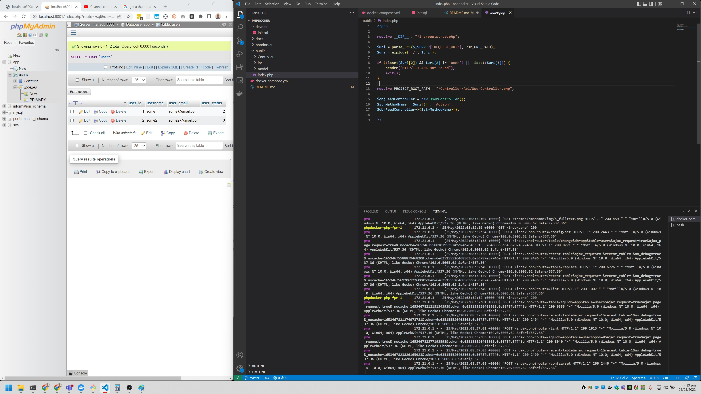

# Simple PHP API

This is a reference implementation of a simple barebones PHP API.

## Development

```bash
docker-compose up
```

# Youtube Reference

[](https://www.youtube.com/watch?v=KcZ0_9DD51Q)

# References

- Simple API Reference: https://code.tutsplus.com/tutorials/how-to-build-a-simple-rest-api-in-php--cms-37000
- PHP Docker Builder: https://phpdocker.io/ 